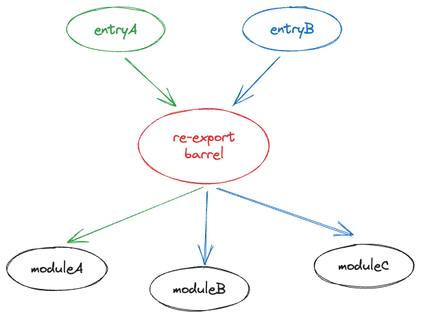

# vite-plugin-export-shaken

A `re-export barrel` is a source code entrypoint that re-exports other modules' exports. It may import useless modules from a `re-export barrel`. Thus you may see there are some useless import requests in Vite dev mode. The more import requests, the slower FCP will be, especially in a huge codebase. This plugin helps shaken these useless modules in `re-export barrel`s in Vite dev mode.